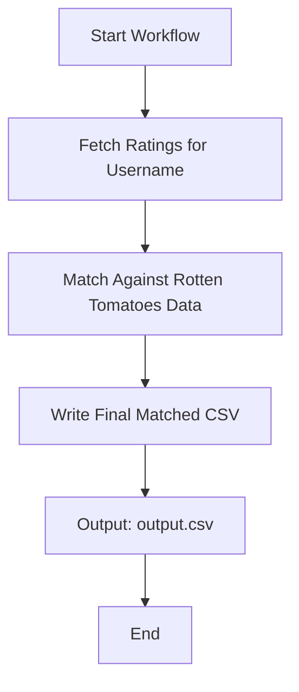

### Letterboxd Film Scraper

### New workflow to compare ratings with rot tom




A script that scrapes films from a Letterboxd user's public diary.

```shell
yarn letterboxd {username}
```

### Result

The films will be saved in the `films.json` file with the following structure:

```js
{
  "updated_at": "2023-08-13",
  "count": 470,
  "films": [
    {
      "watched_on": "2022-10-24",
      "title": "Aftersun (2022)",
      "rating": 4.5,
      "rewatched": false,
      "permalink": "aftersun"
    },
    {
      "watched_on": "2021-03-20",
      "title": "Le Trou (1960)",
      "rating": 5,
      "rewatched": true,
      "permalink": "le-trou"
    },
    ...
    {
      "watched_on": "2020-09-13",
      "title": "Tampopo (1985)",
      "rating": 5,
      "rewatched": false,
      "permalink": "tampopo"
    }
  ]
}
```
