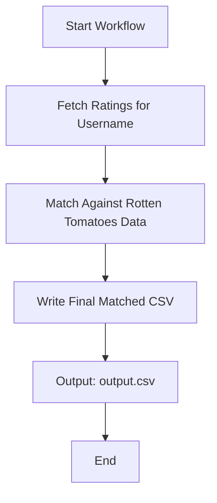

# Letterboxd Film Scraper with Rotten Tomatoes Integration

## Overview

This project is a fork of the original Letterboxd Film Scraper, now enhanced to integrate Rotten Tomatoes data. The goal is to provide a robust pipeline that produces CSV files for data science and analysis. Additionally, this README includes instructions for using DuckDB to query the resulting data.

## Workflow

The following flowchart illustrates the workflow of the pipeline:



## Features

- Scrape films from a Letterboxd user's public diary.
- Match the scraped data against Rotten Tomatoes ratings.
- Generate a CSV file (`output.csv`) for further analysis.

## Installation

1. Clone the repository:
   ```bash
   git clone https://github.com/your-username/letterboxd-scraper.git
   cd letterboxd-scraper
   ```

2. Install dependencies:
   ```bash
   yarn install
   ```

3. Install DuckDB for querying the data:
   - Follow the [DuckDB installation guide](https://duckdb.org/docs/installation).

## Usage

### Scraping Letterboxd Data

Run the following command to scrape a Letterboxd user's public diary:
```bash
yarn letterboxd {username}
```

The scraped data will be saved in the `films.json` file with the following structure:
```json
{
  "updated_at": "2023-08-13",
  "count": 470,
  "films": [
    {
      "watched_on": "2022-10-24",
      "title": "Aftersun (2022)",
      "rating": 4.5,
      "rewatched": false,
      "permalink": "aftersun"
    },
    ...
  ]
}
```

### Running the Workflow

To execute the full pipeline and generate the final CSV file:
```bash
yarn run_workflow
```

The output will be saved as `output.csv`.

### Querying the Data with DuckDB

Once the pipeline has produced the `output.csv` file, you can use DuckDB to query the data:

1. Launch DuckDB:
   ```bash
   duckdb
   ```

2. Load the CSV file:
   ```sql
   CREATE TABLE films AS SELECT * FROM 'output.csv';
   ```

3. Run SQL queries on the data:
   ```sql
   SELECT title, rating FROM films WHERE rating > 4.0;
   ```

## Contributing

Contributions are welcome! Please open an issue or submit a pull request for any improvements or bug fixes.

## License

This project is licensed under the MIT License. See the `LICENSE` file for details.
